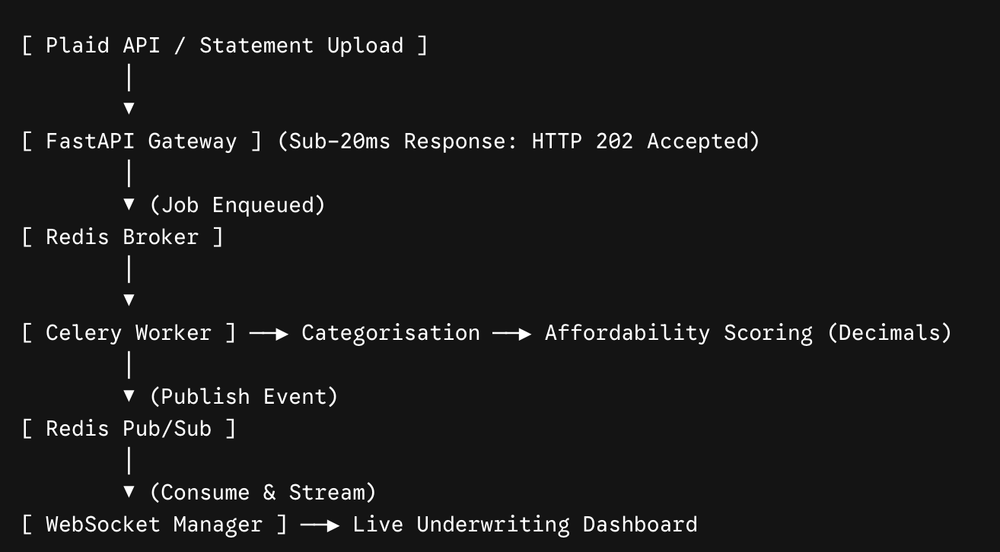

# Open Banking Credit Affordability Engine

A real-time financial data pipeline that takes in bank statements, classifies transactions, computes debt-to-income and risk metrics, and streams underwriting decisions over WebSockets.

## Reason behind this project: 

An interest in learning asynchronous applications. So this is an attempt at building at a headless application that would be able to concurrently run multiple data intensive instructions using non-blocking background workers, event-driven task queues, and real-time streaming architectures. By offloading heavy computation—such as transaction categorisation, fixed-point financial arithmetic, and risk scoring—from the main API thread to a dedicated distributed pipeline (FastAPI, Redis, and Celery), the application ensures ultra-low HTTP response latencies while streaming completed underwriting decisions back to clients instantly over WebSockets.

---

## Quick Start (Docker)

The fastest way to run the entire application (API, Celery worker, Redis broker, and frontend dashboard) is via Docker Compose.

### 1. Prerequisites

* [Docker Desktop](https://www.docker.com/products/docker-desktop/) installed and running.

### 2. Start the Application

Clone the repository and spin up the multi-container stack:

```bash
git clone https://github.com/jzndry/affordability-pipeline.git
cd affordability-pipeline
docker compose up --build

```

### 3. Access the Services

* **Interactive Dashboard:** [http://localhost:8000](http://localhost:8000)
* **Interactive API Documentation (Swagger UI):** [http://localhost:8000/docs](http://localhost:8000/docs)
* **Health Check:** [http://localhost:8000/health](http://localhost:8000/health)


## Running Tests and Quality Checks

Run the automated test suite and static analysis tools locally:

```bash
# Code style and formatting
ruff check .

# Static type analysis
mypy app/

# Unit and integration tests
pytest -v

```

---

## System Architecture



1. **FastAPI Web Layer:** Ingests raw bank statement payloads and validates data schemas via Pydantic v2.
2. **Redis Message Broker:** Enqueues background underwriting tasks and facilitates real-time Pub/Sub channels.
3. **Celery Worker:** Executes transaction categorisation, fixed-point financial arithmetic, and risk decisioning rules.
4. **WebSocket Gateway:** Pushes completed credit assessments to connected clients.
